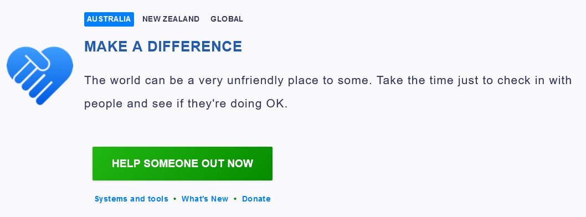
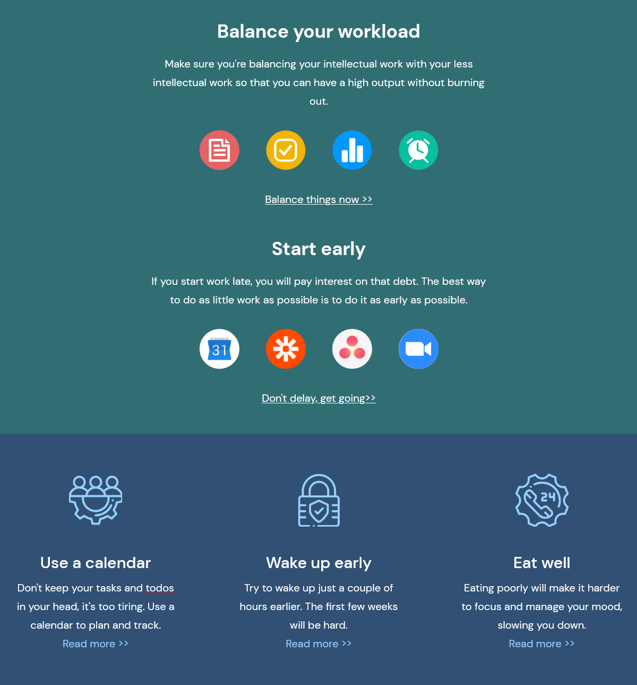
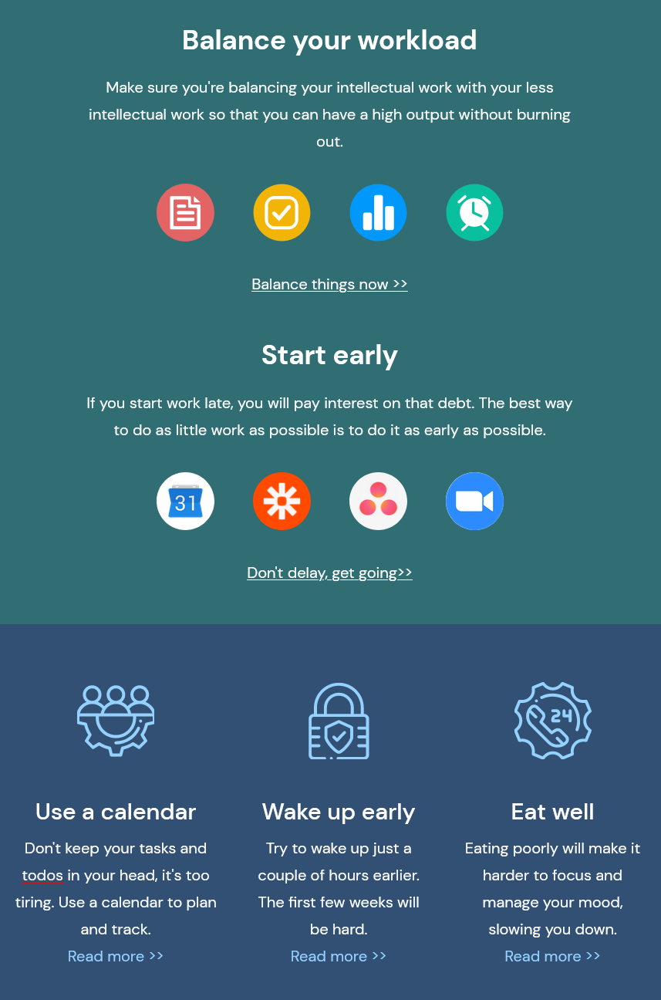
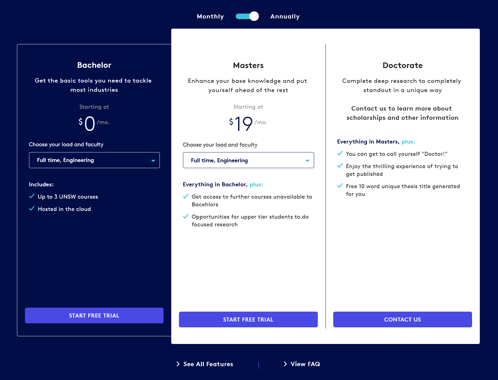

# Assignment 1 - HTML/CSS

## Change Log

 * 21/02: Clarified task 3 tab swap is mobile only; Added tick and arrow assets to task3
 * 21/02: Just a small reminder that you can't use images/assets that aren't provided to you in the assets folder

## Background & Motivation

This assessment focuses on you implementing a series of basic web pages that look and behave like images and descriptions we we provide.

A basic capability required of someone working with user-facing interfaces is to be able to produce a web page that looks and behaves like something that has been clearly specified (e.g. an image). A common workflow within a product team may consist of a designer producing a high fidelity mock-up, which a developer will then take and use HTML/CSS/JS to build the webpage for usage. In reality this process tends to be a bit more collaborative, and the high fidelity mockups provided are usually quite detailed and visually consist of many interact layers. However, for the sake of simplicity and fundamental knowledge we are providing flattened images with written requirements.

This assessment aims to allow students to demonstrate knowledge they've developed during week 1-3 of the course. You will be building web pages with HTML, CSS, and Javascript.

This assessment primarily focuses on demonstrating skills with HTML ("Hyper Text Markup Language") and CSS ("Cascading Style Sheets") covered in week 1 of the course. Most of the tasks centre around this.

The latter part of this assessment touches on some topics from 3. Don't be alarmed if you can't do these tasks until part of the third week - you should be able to complete the vast majority (around 70%) of the assessment before getting to this point. Nothing stops you from watching ahead too - there is no reason you can't watch the material earlier than week 3.

The reason for assessing small parts of Javascript in this assessment is to help give you a springboard to get comfortable with the content so that we can improve your confidence in starting the second assignment.

## Tasks

When we refer to "viewport width" below, we're referring to the size you can set your browser viewport at. You can learn more about how to do this [here](https://developer.chrome.com/docs/devtools/device-mode/).

Each task below is worth 25% of the assignment.

### Task 1 - Static, fixed size page

Build a page that looks identical to `task1/page.png`. The viewport width you should work with is 1058 x 392 pixels. You are only allowed to use HTML and CSS for this task. No external libraries are permitted.

Please build your page in `task1/index.html`. You are welcome to create as many CSS files that you need in the `task1` folder for `index.html` to import. When being marked, your tutor will start with `index.html`.

#### Assets

* The asset(s) are provided in `task1/assets`.
* Your font doesn't have to match exactly. You can use font-family `Arial` or `Helvetica` for the page. Everything else like the font spacing does have to work.

### Task 2 - Responsive static page

Build a page that looks identical to `task2/page_wide.png`. The viewport width you should work with is 1200 x 1289 pixels. You are only allowed to use HTML and CSS for this task. No external libraries are permitted.

Whilst the majority of the marks in this question come from the above, a small portion of marks for this question come from ensuring that your page will work responsively for all sizes between the wide size and the narrow size below. This narrower size is visible in `task2/page_narrow.png`. The width of this narrower layout is `857px`.

You are required to use a layout (e.g. flexbox) that means as you resize the window between these two sizes (wide and narrow) that the various boxes take up the space proportionally.

Please build your page in `task2/index.html`. You are welcome to create as many CSS files that you need in the `task2` folder for `index.html` to import. When being marked, your tutor will start with `index.html`.

Note: You do not need to worry about the red underline under "todos".

#### Assets
* 11 SVG assets have been provided in the `assets` folder.
* The text on screen has been made available in `assets/text.txt`.
* Your font doesn't have to match exactly. You can use font-family `Arial` for the page.

### Task 3 - Responsive static page

Build a responsive page that complies with the following layouts:
 * `task3/page_max_width.PNG` (you do not have to consider sizes bigger than this screen).
 * `task3/page_high_width.PNG`
 * `task3/page_low_width.PNG`
 * `task3/page_min_width.PNG` (you do not have to consider sizes smaller than this screen).
 * `task3/page_dropdown.PNG`

These 5 images can be found in the `task3` folder, though we are displaying `task3/page_max_width.PNG` below.

Your single page (note that you're not using two separate HTML files) should like identical to either of these pages depending on the window sized the browser is at.

Your are expected to have reasonable intermediate states. In other words, if the window size is somewhere between the 4 sizes above, it should still reflect the same general structure.

You can assume the breakpoint (where it snaps from one layout to another) is when the breakpoint width is at `1100px`.

Please build your page in `task3/index.html`. You are welcome to create as many CSS files that you need in the `task3` folder for `index.html` to import. When being marked, your tutor will start with `index.html`.

Other notes include:
 * For mobile only, you will need to use basic javascript for this allow clicking on the tab headers to swap you between the 3 tabs.
 * When transitioning from the wide view to the narrow view you must do this with CSS (and it's OK if this involves some duplication of html code or content).
 * You must ensure the "start free trial" buttons must have a slightly darker colour in the `hover` state. This is demonstrated in the difference in colour between image `page_low_width` and `page_min_width`.
 * When the drop down is clicked, it should display as shown in `page_dropdown`. Note that this behaviour should be the same regardless of screen size. Most of this can be done easily with CSS and the overriding of various `<select>` and `<option>` properties. Some Javascript may be required.

#### Assets
 * Your font doesn't have to match exactly. You can use font-family `Arial` for the page.

### Task 4 - Dynamic form

The page `task4/page.png` displays a series of inputs, and when valid, outputs a "summary" of this information in the textarea at the bottom of the page.

No CSS is required in this task. Please do not worry about styling your pages.

#### The page

Make a page `page4/index.html`.

The page consists of a:
 * Table
   * Text input for First Name (must be between 3 and 50 characters)
   * Text input for Last Name (must be between 3 and 50 characters)
   * Text input for Date of birth (valid input is the exactformat "DD/MM/YYYY" and must be a valid date. This means it must match the regex expression "[0-9]{2}/[0-9]{2}/[0-9]{4}" and when trying to parse it with the Javascript date object it does not return **NaN**)
   * Dropdown for favourite animal (either "Dog" or "Puppy", no other options)
   * Checkbox for cities that they've lived in (Sydney, Melbourne, Adelaide)
 * Remove button
 * Textarea (initially blank)

#### Actions

The following are events that trigger a render that should be binded to particular actions
* Changing of the "cities lived in", or "favourite animal" should trigger a render
* Blur of the "First Name", "Last Name", or "Date of birth" should trigger a render

When the "remove" button is clicked, the `textarea` has all of its text removed (i.e. it becomes blank again), and all of the form elements in the table are reset to their default state.

#### Rendering

The "output" refers to what the inner HTML text should be of the textarea at the bottom of the page.

* If they haven't inputted a firstname, or the firstname entered is invalid, the output should be "Please input a valid firstname"
* If they have inputted a first name, but haven't inputted a last name or the lastname is invalid, the output should be "Please input a valid lastname"
* If they have inputted a first name and a last name, but haven't inputted a valid date of birth, the output should be "Please enter a valid date of birth"
* If they have entered a valid first name, last name, and date of birth, the output is "Hello [first name] [last name], you are [age (integer)] years old, your favourite animal is [favourite animal] and you've lived in [cities]."
  * If no cities are selected, [cities] is "no cities"
  * If 1 city is selected, [cities] is just "[city1]"
  * If 2 or more cities are selected, [cities] is just "[city1], [city2], [city3]"

Please note that we expect all actions and subsequent renders to happen without the refreshing of the webpage.

## Analysing the pages

Two things will want to seek external help for are:
1) Determining the particular colour (RGB or HEX) of various pixels (we recommend the use of [the Firefox eye dropper](https://developer.mozilla.org/en-US/docs/Tools/Eyedropper), though other alternatives may be appropriate for you)
2) Determining the size of particular elements (we recommend the use of [photopea](https://www.photopea.com/)). An example of it's usage is below:

### Font Sizes

You will also be curious to know what the correct font-size and other font properties are for this assignment. Part of this assignment is trying to explore the relationship between how a font looks and the properties that are set for the element. Generally the best approach is to set a basic font size (e.g. `font-size: 20pt`), see how it looks, and if it just generally seems too big or too small, then adjust the `pt` value appropriately until you're comfortable with it. You will not be penalised for having font that is off by a few pixels in size. We will cover best practices when it comes to font sizing later in the course. 

## Constraints & Assumptions

### Browser Compatibility

You should ensure that your programs have been tested on one of the following two browsers:
 * Locally, Google Chrome (various operating systems) version 93.XX
 * On CSE machines, Chromium

### External libraries

You are restricted from using any third party CSS or JS libraries when completing this assessment. Basically, this means you can't import code using the `<script />` and `<link />` tags if it's from a file you did not write yourself, and you shouldn't be copying any larger chunks of code from other sources.

## Marking Criteria

Your assignment will be hand-marked by tutor(s) in the course according to the criteria below.

<table>
	<tr>
		<th>Criteria</th>
		<th>Weighting</th>
		<th>Description</th>
	</tr>
	<tr>
		<td>Visual Compliance</td>
		<td>50%</td>
		<td>
			<ul>
				<li>Rendered static HTML page accurately matches the reference image provided for each task (within a few pixels)</li>
				<li>For specified tasks, pseudo-class behaviour satisfies the task requirements</li>
				<li>For specified tasks, rendered HTML page renders appropriately for intermediate sizes</li>
				<li>For specified tasks, JS events triggered by specific actions occur as specified</li>
			</ul>
		</td>
	</tr>
	<tr>
		<td>Code Quality</td>
		<td>50%</td>
		<td>
			<ul>
				<li>HTML is appropriately formatted such that each inner HTML is indented with respect to the outer one</li>
				<li>CSS is appropriate structured to be placed in external stylesheets rather than inline styles</li>
				<li>CSS ID and class selectors are clearly and meaningfully named</li>
				<li>CSS has limited repetition where multiple similar components use the same underlying styles</li>
				<li>JS code is appropriately styled and formatted based on common conventions shown in lectures</li>
				<li>Ensure that source code (HTML, CSS, JS) is no more complicated or verbose than necessary to solve a given problem (less is more).</li>
				<li>Maintaining separation between HTML and CSS for structural and stylistic aspects, respectively</li>
				<li>Avoiding usage of more obselete methods of page styling that have been discussed in lectures (e.g. tables for non-tabular purposes)</li>
				<li>Implementation is simple, and no more complicated or difficult to understand than necessary</li>
			</ul>
		</td>
	</tr>
</table>

## Originality of Work

The work you submit must be your own work.  Submission of work partially or completely derived from
any other person or jointly written with any other person is not permitted.

The penalties for such an offence may include negative marks, automatic failure of the course and
possibly other academic discipline. Assignment submissions will be examined both automatically and
manually for such submissions.

Relevant scholarship authorities will be informed if students holding scholarships are involved in
an incident of plagiarism or other misconduct.

Do not provide or show your assignment work to any other person &mdash; apart from the teaching
staff of COMP6080.

If you knowingly provide or show your assignment work to another person for any reason, and work
derived from it is submitted, you may be penalized, even if the work was submitted without your
knowledge or consent.  This may apply even if your work is submitted by a third party unknown to
you.

Every time you make commits or pushes on this repository, you are acknowledging that the work you
submit is your own work (as described above).

Note you will not be penalized if your work has the potential to be taken without your consent or
knowledge.

## Submission

This assignment is due *Monday 7th March, 10am*.

To submit your assignment, you must complete the following two steps in order:
 * Ensure you've pushed all of your code to your gitlab master branch. You can check if you've done this properly by seeing what code is on the gitlab site on your master branch.
 * Run the following command on a CSE terminal (SSH, vlab): `$ 6080 submit ass1`
 simply run the following command on a CSE terminal:

This will submit the latest commit on master as your submission.

It is your responsibiltiy to ensure that your code can run successfully when cloned fresh from Gitlab.

## Late Submission Policy

If your assignment is submitted after this date, each hour it is late reduces the maximum mark it can achieve by 2%.

For example if an assignment you submitted with a raw awarded mark of 85% was submitted 5 hours late, the late submission would have no effect (as maximum mark would be 90%). If the same assignment was submitted 20 hours late it would be awarded 60%, the maximum mark it can achieve at that time.
